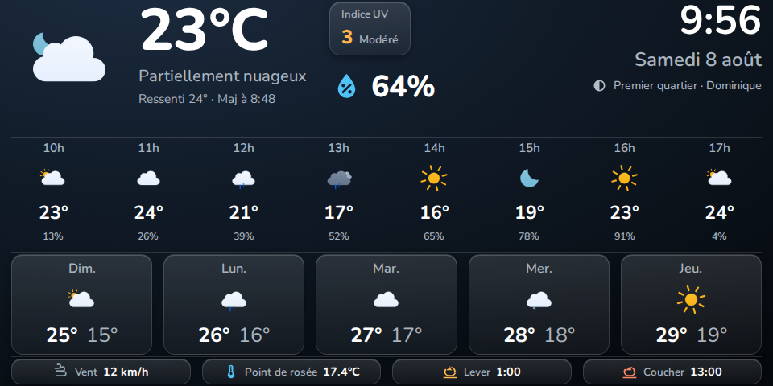

# echo-weather-card

Carte météo Home Assistant compacte et sans chrome, pensée pour les petits
smart displays (Amazon Echo Show 5 sous LineageOS/VACA + [View
Assist](https://dinki.github.io/View-Assist/), écran 960x480 en paysage —
mais fonctionne dans n'importe quel dashboard Lovelace).



> Rendu généré via un navigateur headless en 960x480 avec des données de
> test. Police Nunito appliquée via `--echo-weather-font-family` (non
> incluse par la carte, voir [Polices](#polices) plus bas).

Statut : en développement actif. L'API et les options ci-dessous sont
globalement stables mais peuvent encore évoluer avant une release 1.0.

## Fonctionnalités

- Météo actuelle : icône animée, température, condition, ressenti,
  humidité, indice UV (optionnel), horloge, date, phase de lune, saint du
  jour.
- Prévisions horaires et journalières, nombre de créneaux configurable.
- Vent, point de rosée, lever/coucher du soleil en bandeau bas.
- Icônes [Meteocons](https://github.com/basmilius/meteocons) chargées
  depuis un CDN (ou une base locale) ; les icônes de prévisions sont
  automatiquement figées (animation retirée) pour préserver le FPS sur du
  matériel modeste — seule l'icône météo actuelle reste animée.
- Thème clair/sombre automatique d'après le soleil (`sun.sun`), ou forcé.
- Fond et apparence personnalisables via variables CSS, sans surcharge de
  `ha-card` — la carte ne dessine aucun chrome par défaut.
- Prévisions récupérées via l'API moderne de Home Assistant (souscription
  WebSocket poussée par le serveur), avec repli automatique sur
  `weather.get_forecasts` si l'entité ne supporte pas la souscription.
- `entity: weather.xxx` seul suffit : toutes les autres options ont des
  valeurs par défaut sensées.

## Installation

### Via HACS (recommandé)

1. HACS → menu ⋮ → **Dépôts personnalisés**.
2. URL : `https://github.com/Alolo222/echo-weather-card`, catégorie
   **Dashboard**.
3. Installer **Echo Weather Card**, puis recharger le frontend
   (Ctrl+F5 sur la page du dashboard).

### Manuelle

1. Copier `dist/echo-weather-card.js` dans `<config>/www/` (par exemple
   `<config>/www/echo-weather-card.js`).
2. Ajouter la ressource dans **Paramètres → Tableaux de bord → Ressources** :
   - URL : `/local/echo-weather-card.js`
   - Type : Module JavaScript
3. Recharger le frontend.

## Démarrage rapide

```yaml
type: custom:echo-weather-card
entity: weather.maison
```

## Configuration complète

```yaml
type: custom:echo-weather-card
entity: weather.maison          # requis — seule option obligatoire

# --- Prévisions ---
hourly_count: 6                 # nombre de créneaux horaires affichés
daily_count: 4                  # nombre de jours affichés

# --- Localisation ---
language: null                  # ex: "fr" — sinon hérite de hass.locale
time_format: null               # "12" ou "24" — sinon hérite de hass.locale

# --- Icônes ---
icons:
  provider: meteocons
  style: fill                   # cf. dépôt Meteocons pour les styles dispo
  base_url: null                # ex: /local/meteocons pour un usage hors-ligne
  animate_current: true         # false = fige aussi l'icône météo actuelle
                                 # (les icônes de prévisions sont toujours
                                 # figées) — utile si l'appareil peine à
                                 # suivre même une seule icône animée

# --- Sections et éléments affichés ---
show_current: true
show_hourly: true
show_daily: true
show_feels_like: true           # "Ressenti X°" sous la condition
show_precipitation_probability: true
show_humidity: true             # icône goutte + valeur
show_dew_point: true            # dans le bandeau bas
show_clock: true
show_date: true
show_last_updated: true         # "Maj à HH:MM"
show_wind: true                 # dans le bandeau bas
show_sun: true                  # lever/coucher dans le bandeau bas
show_moon: true                 # phase de lune sous la date

# --- Entités additionnelles (aucune n'est requise) ---
sun_entity: null                # sinon sun.sun
moon_entity: null               # sinon sensor.moon_phase (intégration Moon HA)
uv_entity: null                 # capteur d'indice UV, ex: sensor.uv_index
air_quality_entity: null        # configurable mais non affiché pour l'instant
dew_point_entity: null          # capteur externe si l'entité météo n'expose
                                 # pas dew_point nativement (ex: Météo-France,
                                 # voir "Point de rosée" plus bas)

# --- Apparence ---
title: null                     # titre optionnel affiché en haut
background: null                # ex: "transparent" ou tout CSS `background`
                                 # — sinon dégradé par défaut selon le thème
theme_mode: auto                # "auto" (selon le soleil), "light", "dark"
```

## Point de rosée

Certaines intégrations météo (notamment **Météo-France**) n'exposent pas
d'attribut `dew_point` natif sur l'entité `weather.*`. Dans ce cas, la
carte n'affichera rien pour cette donnée tant que `dew_point_entity` n'est
pas renseigné avec un capteur qui le calcule.

Exemple de template sensor (formule de Magnus-Tetens), à adapter aux noms
de vos entités de température et d'humidité :

```yaml
template:
  - sensor:
      - name: "Point de rosée"
        unique_id: point_de_rosee
        unit_of_measurement: "°C"
        device_class: temperature
        state: >
          
          
          
          
          
          {{ ((b * alpha) / (a - alpha)) | round(1) }}
```

Puis dans la config de la carte :

```yaml
dew_point_entity: sensor.point_de_rosee
```

## Polices

La carte n'embarque aucune police : elle hérite de `--primary-font-family`
(la variable de thème standard de Home Assistant) si elle est définie,
sinon de la police héritée du reste de la page. Pour forcer une police
précise (Google Fonts ou autre), passer par `--echo-weather-font-family`,
par exemple via [card-mod](https://github.com/thomasloven/lovelace-card-mod) :

```yaml
type: custom:echo-weather-card
entity: weather.maison
card_mod:
  style: |
    :host {
      --echo-weather-font-family: "Nunito", sans-serif;
    }
```

La police doit être chargée par ailleurs (import `<link>` dans le thème,
accès internet à Google Fonts, ou police déjà présente sur l'appareil).

## Variables CSS (theming)

Toutes optionnelles — la carte a des valeurs par défaut complètes sans rien
à régler. À poser sur le sélecteur `:host` de la carte (via `card_mod` ou
un thème), comme dans l'exemple de police ci-dessus.

| Variable | Rôle | Défaut |
|---|---|---|
| `--echo-weather-font-family` | Police du texte | hérite de `--primary-font-family`, sinon `inherit` |
| `--echo-weather-radius` | Arrondi des coins de la carte | `0px` (pleine largeur/hauteur d'écran) |
| `--echo-weather-text-color` | Couleur du texte principal | blanc (sombre) / `#16232e` (clair) |
| `--echo-weather-secondary-color` | Couleur du texte secondaire | gris clair/sombre selon le thème |
| `--echo-weather-divider-color` | Couleur des séparateurs horizontaux | selon le thème |
| `--echo-weather-tile-background` | Fond des tuiles (UV, prévisions, bandeau) | dégradé translucide selon le thème |
| `--echo-weather-tile-border` | Bordure des tuiles | selon le thème |
| `--echo-weather-tile-shadow` | Ombre/relief des tuiles | selon le thème |
| `--echo-weather-gap` | Espacement horizontal (icônes, tuiles) | `14px` |
| `--echo-weather-row-gap` | Espacement vertical entre sections | `2px` |
| `--echo-weather-icon-size` | Taille des icônes horaires | `clamp(64px, 8.5cqw, 84px)` |
| `--echo-weather-current-icon-size` | Taille de l'icône météo actuelle | `clamp(100px, 15cqw, 155px)` |
| `--echo-weather-current-temp-size` | Taille de la température actuelle | `clamp(3rem, 7.6cqw, 4.6rem)` |
| `--echo-weather-hourly-temp-size` | Taille des températures horaires | `clamp(1.15rem, 2.4cqw, 1.5rem)` |
| `--echo-weather-daily-icon-size` | Taille des icônes journalières | `clamp(38px, 5.2cqw, 49px)` |
| `--echo-weather-daily-temp-size` | Taille des températures journalières | `clamp(1.3rem, 2.6cqw, 1.6rem)` |
| `--echo-weather-uv-color` | Couleur de la valeur UV | `#ffb74d` |
| `--echo-weather-humidity-color` | Couleur de l'icône humidité | `#4fc3f7` |
| `--echo-weather-moon-color` | Couleur de l'icône lune | `#b0bec5` |
| `--echo-weather-wind-color` | Couleur de l'icône vent | `#90a4ae` |
| `--echo-weather-dew-point-color` | Couleur de l'icône point de rosée | `#4fc3f7` |
| `--echo-weather-sunrise-color` | Couleur de l'icône lever de soleil | `#ffb74d` |
| `--echo-weather-sunset-color` | Couleur de l'icône coucher de soleil | `#ff8a65` |

Les tailles utilisent `clamp()` avec des unités `cqw` (container query) :
elles suivent la largeur réelle de la carte plutôt que celle de l'écran,
donc restent cohérentes si la carte est redimensionnée dans un dashboard.

Pour un fond personnalisé (couleur unie, image, ou transparent), utiliser
plutôt l'option de config `background` plutôt qu'une variable CSS :

```yaml
background: transparent
```

## Crédits

- Icônes météo : [Meteocons](https://github.com/basmilius/meteocons) par
  Bas Milius, licence MIT.
- Développé pour un usage avec [View Assist](https://dinki.github.io/View-Assist/).

## Licence

MIT — voir [LICENSE](LICENSE).
