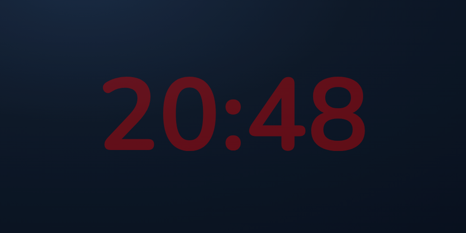
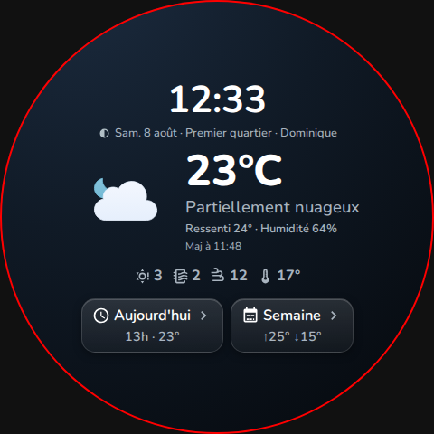
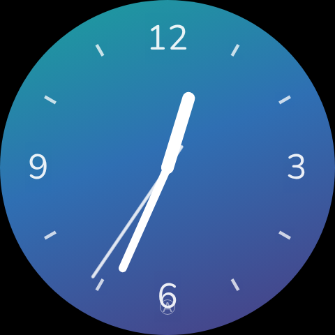
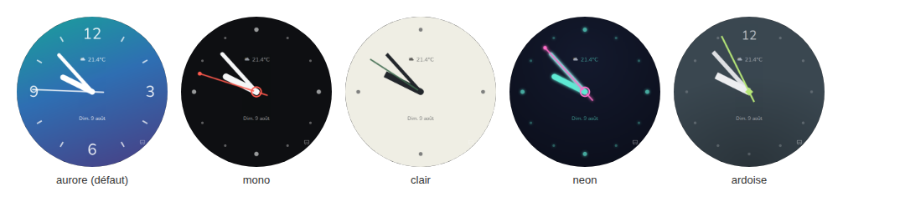
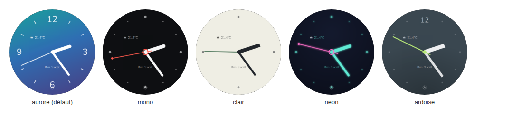

# echo-home-card

> [!NOTE]
> Projet à vocation personnelle : développé pour mes propres appareils
> (Echo Show 5 / Echo Spot). Il ne sera pas activement maintenu et les
> issues ne sont pas ouvertes. Envie de l'améliorer, de l'adapter ou
> d'aller plus loin ? Forkez le dépôt !

Carte d'accueil Home Assistant compacte et sans chrome pour les petits
smart displays (Amazon Echo Show 5 sous LineageOS/VACA + [View
Assist](https://dinki.github.io/View-Assist/), écran 960x480 en paysage —
mais fonctionne dans n'importe quel dashboard Lovelace). Horloge géante +
date + mini bloc météo cliquable, sur un fond dynamique fourni par
l'entité satellite View Assist, avec un mode nuit dédié.


> Rendu généré via un navigateur headless en 960x480 avec des données de
> test. Police Nunito appliquée via `--echo-home-font-family` (non
> incluse par la carte, voir [Polices](#polices) plus bas).

C'est le remplacement, en vraie carte Lit, de la vue d'accueil (« clock
view ») fournie par défaut par View Assist — telle que je l'avais
personnalisée en `custom:button-card` (horloge, mini météo cliquable,
fond dynamique, mode nuit). Même comportement, mais sans les limites de
button-card (templates YAML imbriqués, pas de vraie mise en cache des
tailles, relecture pénible) et avec un vrai mode round pour l'Echo Spot,
qui n'existait pas dans la version button-card.

Statut : stable (v1.0). Développée dans la continuité de
[echo-weather-card](https://git.alocoq.fr/alois/echo-weather-card),
testée en rendu headless ; vérification sur Echo Show 5 / Echo Spot 1ère
gen à faire avant usage quotidien (voir [gotchas
matériel](#gotchas-matériel-echo-show-5--echo-spot) plus bas).

## Fonctionnalités

- Horloge géante + date, lisibles de loin, sur fond plein écran — mêmes
  proportions que le button-card d'origine (horloge à 55vh, date et
  bloc météo tous deux à 15vh). L'horloge est pile centrée verticalement
  sur l'écran (positionnement indépendant, pas juste le centre d'un
  groupe horloge+date qui la décalerait vers le haut), la date juste en
  dessous ; le bloc météo est positionné à part, en haut.
- Fond dynamique : reprend l'attribut `background` (URL d'image) de
  l'entité satellite View Assist, avec un léger voile sombre pour garder
  le texte lisible dessus. Repli sur un dégradé sombre si aucune image
  n'est disponible.
- Mini bloc météo (icône [Meteocons](https://github.com/basmilius/meteocons)
  + température avec une décimale et son unité, ex: `21.4°C`) en coin,
  qui **tape → navigue vers la vue météo** du dashboard View Assist via
  le service `view_assist.navigate`.
- **Mode nuit** : piloté par l'attribut `mode` de l'entité satellite
  (`mode: "night"`) — fond masqué, horloge en rouge très atténué, date et
  bloc météo masqués. Pensé pour un écran de chevet qui ne doit pas
  éblouir la nuit.
- Mise en page alternative `layout: round` pour l'Echo Spot 1ère gen
  (2017, écran circulaire 480x480) : mêmes éléments, repositionnés pour
  rester dans la zone visible du cercle (le bloc météo ne se place pas
  dans un coin, qui serait sous le boîtier physique).
- En mode round, **horloge analogique plein écran** en alternative au
  digital — un clin d'œil au cadran rond de l'Echo Spot sous Alexa,
  avant LineageOS/View Assist. Écran à part entière (pas une variante du
  digital) : pas de photo de fond, pas de météo, pas de date, juste les
  aiguilles sur un fond bleu uni personnalisable, comme sur l'appareil
  d'origine. Un petit bouton discret (masqué la nuit) bascule entre les
  deux ; le choix est retenu au-delà du rechargement de la page. Voir
  [Mode round](#mode-round-echo-spot).
- Aucune entité n'est requise : sans rien configurer, la carte reste une
  horloge plein écran sur fond dégradé.
- Thème et tailles personnalisables via variables CSS, sans surcharge de
  `ha-card` — la carte ne dessine aucun chrome par défaut.

## Installation

### Via HACS (recommandé)

1. HACS → menu ⋮ → **Dépôts personnalisés**.
2. URL : `https://git.alocoq.fr/alois/echo-home-card`, catégorie
   **Dashboard**.
3. Installer **Echo Home Card**, puis recharger le frontend (Ctrl+F5 sur
   la page du dashboard).

### Manuelle

1. Copier `dist/echo-home-card.js` dans `<config>/www/` (par exemple
   `<config>/www/echo-home-card.js`).
2. Ajouter la ressource dans **Paramètres → Tableaux de bord → Ressources** :
   - URL : `/local/echo-home-card.js`
   - Type : Module JavaScript
3. Recharger le frontend.

## Démarrage rapide

```yaml
type: custom:echo-home-card
satellite_entity: sensor.viewassist_chambre
weather_entity: weather.maison
dashboard: dashboard-view-assist
```

### L'utiliser comme vue d'accueil View Assist

Dans la définition de la vue « background »/« clock » de votre dashboard
View Assist, remplacer la carte `custom:button-card` d'origine par
celle-ci — le service appelé au tap sur la météo (`view_assist.navigate`)
et les attributs lus sur l'entité satellite (`mode`, `background`) sont
les mêmes que ceux du template par défaut, donc rien d'autre à changer
côté automatisations/View Assist.

## Configuration complète

```yaml
type: custom:echo-home-card

# --- Entités (aucune n'est requise) ---
satellite_entity: null          # entité satellite View Assist — lit
                                 # attributes.mode ("night" => mode nuit)
                                 # et attributes.background (URL de fond)
weather_entity: null            # bloc météo compact (icône + température)
                                 # — bloc simplement absent si non renseignée
sun_entity: null                # sinon sun.sun — choisit la variante
                                 # jour/nuit de l'icône météo uniquement

# --- Navigation (bloc météo cliquable) ---
dashboard: null                 # base du chemin envoyé à view_assist.navigate,
                                 # ex: "dashboard-view-assist" — tant que non
                                 # renseigné, le bloc météo n'est pas cliquable
weather_view: weather           # ajouté à `dashboard` -> "${dashboard}/${weather_view}"
navigate_device: null           # id passé en `device` au service — sinon
                                 # satellite_entity

# --- Éléments affichés ---
show_clock: true
show_date: true
show_weather: true

# --- Localisation ---
language: null                  # ex: "fr" — sinon hérite de hass.locale
time_format: null               # "12" ou "24" — sinon hérite de hass.locale

# --- Icônes ---
icons:
  provider: meteocons
  style: fill                   # fill (défaut) / line / flat / monochrome
  base_url: null                # ex: /local/meteocons pour un usage hors-ligne
                                 # (prime sur style si renseigné)

# --- Apparence ---
background: null                # override CSS `background` complet du mode
                                 # DIGITAL (couleur unie, dégradé,
                                 # transparent...) — prioritaire sur l'image
                                 # dynamique du satellite. Sans effet en
                                 # analogique (voir analog_background) : les
                                 # deux présentations ont leur propre fond
layout: null                    # null (paysage, Echo Show) ou "round"
                                 # (écran circulaire, Echo Spot 1ère gen 2017)
clock_face: digital             # "digital" ou "analog" — mode round
                                 # uniquement. Valeur de départ seulement :
                                 # le bouton affiché en mode round retient
                                 # le choix de l'utilisateur au-delà (voir
                                 # "Mode round" plus bas), qui prime sur
                                 # cette option une fois qu'il a tapé dessus
analog_style: aurore            # habillage du cadran analogique : "aurore"
                                 # (défaut), "mono", "clair", "neon" ou
                                 # "ardoise" (voir "Horloge analogique" plus
                                 # bas). Contrairement à clock_face, un seul
                                 # réglage YAML — pas de bouton pour en
                                 # changer à l'écran ni de mémorisation
analog_background: null         # override CSS `background` complet du mode
                                 # ANALOGIQUE — sinon le dégradé par défaut
                                 # d'analog_style. Jamais de photo ici (le
                                 # cadran analogique n'en affiche pas) ; comme
                                 # background, sans effet la nuit
zoom: 1                         # facteur d'échelle manuel (CSS zoom) — filet
                                 # de rattrapage si le texte ne suit pas
                                 # correctement la taille de l'écran
```

## Mode nuit

Le mode nuit n'est pas basé sur l'heure : il suit l'attribut `mode` de
`satellite_entity` (`mode: "night"`), exactement comme le template View
Assist d'origine — c'est donc une automatisation côté Home Assistant (ou
une action manuelle) qui décide quand l'écran doit s'assombrir, pas la
carte elle-même.



En mode nuit : le fond est masqué (uni, pas d'image chargée), l'horloge
passe en rouge fortement atténué (`--echo-home-night-color` /
`--echo-home-night-opacity`), et la date ainsi que le bloc météo sont
masqués.

## Mode round (Echo Spot)

`layout: round` clippe la carte elle-même en cercle (`border-radius: 50%`
sur son propre fond) plutôt que de compter sur le boîtier physique, et
repositionne le bloc météo en haut centré plutôt qu'en coin — un coin
serait caché sous le boîtier sur un écran rond.

### Horloge analogique

L'Echo Spot d'origine (sous Alexa, avant LineageOS/View Assist) affichait
une horloge ronde à aiguilles, plein écran, sur fond uni — pas de photo
de fond superposée. Un petit bouton discret (en bas du cadran, masqué la
nuit comme le reste) permet de retrouver ce rendu en alternative au
digital : c'est un véritable écran à part, pas juste une autre police
d'horloge — pas de fond dynamique, juste les aiguilles (heure, minute et
seconde — celle-ci avance en continu via une animation CSS, pas un
recalcul JS chaque seconde, plus léger sur du matériel modeste), selon
le style choisi quelques graduations ou chiffres, et, discrètement, la
météo et la date (voir plus bas).

| Digital | Analogique |
|---|---|
|  |  |

Le choix fait via ce bouton est retenu dans le navigateur (`localStorage`)
au-delà d'un rechargement de page — `clock_face` dans la config ne sert
que de valeur de départ, écrasée dès le premier tap sur le bouton.

Cinq habillages du cadran lui-même, choisis via `analog_style` dans la
config (pas de bouton pour celui-ci — un seul style par installation) :



| Style | |
|---|---|
| `aurore` (défaut) | Dégradé turquoise → bleu → violet, chiffres à 12/3/6/9, fines graduations sur les autres heures. |
| `mono` | Fond quasi noir, aiguilles blanches, seconde corail — l'esprit d'une montre de sport minimaliste. |
| `clair` | Fond clair, aiguilles encre plates, quatre points cardinaux — sobre, presque scandinave. |
| `neon` | Bleu nuit profond, cyan lumineux avec halo, seconde magenta — plus gadget, plus spectaculaire. |
| `ardoise` | Aiguilles rectangulaires plutôt que des traits, seule l'heure 12 est marquée — plus architectural. |

Le fond par défaut de chaque style se personnalise avec l'option
`analog_background` (voir [Configuration
complète](#configuration-complète)) — un simple champ YAML, indépendant
de `background` qui ne concerne que le mode digital. Pour un réglage via
`card_mod` plutôt que dans la config de la carte, la variable CSS
`--echo-home-analog-background` fait la même chose et garde la priorité
sur les deux si elle est définie :

```yaml
card_mod:
  style: |
    :host {
      --echo-home-analog-background: #1a1a1a;
    }
```

La nuit, ce fond n'est jamais utilisé — même en analogique, le mode nuit
retombe sur son traitement habituel (fond quasi noir, peu de lumière
émise).

#### Météo et date sur le cadran

Comme en digital, `show_weather`/`show_date` affichent la météo (icône +
température de `weather_entity`) et la date sur le cadran analogique — en
plus discret, à la manière d'un guichet de date sur une montre
mécanique : la météo juste au-dessus du centre, la date juste en
dessous, symétriques sur l'axe midi-6h, chacune dans la couleur du style
choisi.



Les aiguilles (et les graduations/chiffres) restent toujours visibles
par-dessus, comme sur une vraie montre à guichet : une aiguille peut
passer devant la météo ou la date sans gêner la lecture, ni de l'une ni
de l'autre. Comme en digital, ni la météo ni la date ne s'affichent la
nuit.


```yaml
type: custom:echo-home-card
satellite_entity: sensor.viewassist_salon
weather_entity: weather.maison
dashboard: dashboard-view-assist
layout: round
```

## Taille du texte

Contrairement à [echo-weather-card](https://git.alocoq.fr/alois/echo-weather-card),
cette carte n'a pas besoin de la mécanique `clamp()` + unités *container
query* (`cqw`, non supportées par un WebView embarqué trop ancien —
Chromium 105+ requis) : elle est pensée pour occuper tout l'écran d'un
smart display plutôt que d'être redimensionnée dans une grille Lovelace.
Ses tailles fluides se basent directement sur `vh`/`vmin` (viewport),
supportées depuis bien plus longtemps, sans repli à prévoir.

Si le texte reste malgré tout trop petit (ou trop grand) sur un appareil
donné, `zoom` permet un ajustement manuel (voir [Configuration
complète](#configuration-complète) plus haut).

Ce calcul se base sur la hauteur disponible (`vh`/`vmin`), pas sur le
contenu réel de l'heure/la date — une heure à deux chiffres ("23:59"),
un format 12h (qui ajoute "AM"/"PM") ou une abréviation de date plus
longue dans certaines langues prennent plus de place qu'une heure à un
chiffre. L'heure et la date se réduisent donc automatiquement (mesuré à
l'affichage, pas deviné à l'avance) si leur taille normale déborderait
de l'écran — sans jamais rétrécir inutilement le cas courant.

## Polices

La carte n'embarque aucune police : elle hérite de `--primary-font-family`
(la variable de thème standard de Home Assistant) si elle est définie,
sinon de la police héritée du reste de la page. Pour forcer une police
précise, passer par `--echo-home-font-family`, par exemple via
[card-mod](https://github.com/thomasloven/lovelace-card-mod) :

```yaml
type: custom:echo-home-card
card_mod:
  style: |
    :host {
      --echo-home-font-family: "Nunito", sans-serif;
    }
```

## Variables CSS (theming)

Toutes optionnelles — la carte a des valeurs par défaut complètes sans
rien à régler. À poser sur le sélecteur `:host` de la carte (via
`card_mod` ou un thème).

| Variable | Rôle | Défaut |
|---|---|---|
| `--echo-home-font-family` | Police du texte | hérite de `--primary-font-family`, sinon `inherit` |
| `--echo-home-radius` | Arrondi des coins de la carte (mise en page large) | `0px` |
| `--echo-home-text-color` | Couleur du texte (horloge, date, météo) | `#ffffff` |
| `--echo-home-night-color` | Couleur de l'horloge en mode nuit | `red` |
| `--echo-home-night-opacity` | Opacité de l'horloge en mode nuit | `0.35` |
| `--echo-home-shader-color` | Voile posé sur l'image de fond pour la lisibilité | `rgba(0, 0, 0, 0.15)` |
| `--echo-home-clock-size` | Taille de l'horloge (mise en page large) | `clamp(6rem, 55vh, 20rem)` |
| `--echo-home-date-size` | Taille de la date (mise en page large) | `clamp(2rem, 15vh, 6rem)` |
| `--echo-home-weather-icon-size` | Taille de l'icône météo (mise en page large) | `clamp(48px, 16vh, 130px)` |
| `--echo-home-weather-temp-size` | Taille de la température (mise en page large) | `clamp(1.8rem, 15vh, 5rem)` |
| `--echo-home-analog-background` | Fond du cadran analogique — prime sur `analog_background` (config) et sur le style choisi | dégradé du style (`analog_style`) |

Le mode round a ses propres tailles ajustées, non exposées en variables
CSS (comme dans echo-weather-card).

Pour un fond personnalisé (couleur unie, image, ou transparent) plutôt
que l'image dynamique du satellite ou le dégradé par défaut, utiliser
l'option de config `background` :

```yaml
background: transparent
```

## Gotchas matériel Echo Show 5 / Echo Spot (LineageOS + View Assist)

- Les *container queries* CSS (`cqw`) peuvent ne pas être supportées par
  le WebView embarqué (peut être bien plus ancien que Chromium grand
  public, support `cqw` arrivé en Chromium 105, mi-2022). Cette carte
  n'en a pas besoin (voir [Taille du texte](#taille-du-texte)), mais le
  point reste valable pour d'autres cartes du même dashboard.
- `ha-dialog` varie selon la version de HA (ancienne implémentation
  MDC/mwc vs nouvelle WebAwesome/`wa-dialog`) — sans objet ici, cette
  carte n'ouvre aucun dialogue.
- Icône SVG animée (SMIL) + `filter: drop-shadow()` sur le même élément
  fait chuter le FPS sur GPU faible (recalcul du filtre à chaque frame) —
  cette carte n'affiche qu'une seule icône météo, sans filtre CSS dessus,
  donc peu de risque, mais à garder en tête si vous en ajoutez un via
  `card_mod`.
- Le test headless (Playwright) ne révèle pas les bugs propres au
  GPU/WebView réel — la vérification sur l'appareil réel reste
  indispensable avant un usage quotidien.
- Écran rond (Echo Spot) : la carte se clippe elle-même en cercle plutôt
  que de compter sur le boîtier physique, et le bloc météo est
  repositionné en haut centré (pas en coin) pour la même raison.

## Crédits

- Icônes météo : [Meteocons](https://github.com/basmilius/meteocons) par
  Bas Milius, licence MIT.
- Développé pour un usage avec [View Assist](https://dinki.github.io/View-Assist/)
  et le [View Assist Companion App](https://github.com/msp1974/ViewAssist_Companion_App)
  (VACA).
- Vue d'accueil originale (`custom:button-card`) : template par défaut de
  View Assist, personnalisé.

## Licence

MIT — voir [LICENSE](LICENSE).
