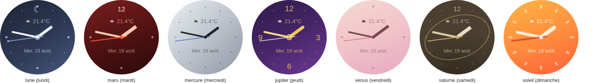
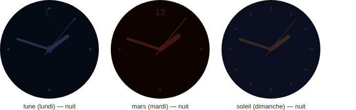

# echo-home-card

Écran d'accueil pour smart display Home Assistant (Amazon Echo Show 5 /
Echo Spot sous LineageOS + [View Assist](https://dinki.github.io/View-Assist/),
mais fonctionne dans n'importe quel dashboard Lovelace) — l'horloge et la
météo compacte que View Assist affiche par défaut, remplacées par une
vraie carte Lit pensée pour ce contexte précis : sans chrome, lisible de
loin, sobre la nuit.

Documentation complète (toutes les options de config, exemples YAML,
captures) : [`packages/echo-home-card/README.md`](../packages/echo-home-card/README.md).
Ce qui suit est un aperçu.

## Deux présentations, au choix

- **Digital** : l'heure en grand, la date et une puce météo discrète
  (icône + température, cliquable pour naviguer vers une vue météo).
- **Analogique** : un cadran SVG (heure/minute/seconde, la seconde tourne
  en continu via une animation CSS plutôt qu'un recalcul JS — plus léger
  sur du matériel modeste), météo et date posées dessus façon guichet de
  date de montre mécanique.

Un petit bouton à l'écran bascule de l'un à l'autre et retient le choix
(`localStorage`) au-delà d'un rechargement de page — `clock_face` dans la
config ne sert que de valeur de départ.

## Douze styles pour le cadran analogique

Cinq styles "classiques" (`aurore`, `mono`, `clair`, `neon`, `ardoise`),
et sept styles "planétaires" — un par jour de la semaine, sur le nom
latin dont vient le jour français (lundi = Lune, mardi = Mars, mercredi =
Mercure, jeudi = Jupiter, vendredi = Vénus, samedi = Saturne, dimanche =
Soleil) :

`analog_style: auto` choisit tout seul le style planétaire du jour,
recalculé à chaque rendu — l'horloge change de tête toute seule à
minuit, sans reconfiguration. Les styles planétaires gardent en plus une
identité propre la nuit (teinte sombre distincte par jour), là où les 5
styles classiques retombent sur le traitement nuit uniforme habituel
(rouge très atténué) :

## Deux mises en page

- **`layout: round`** (Echo Spot, écran carré/rond 480×480) : carte
  clippée en cercle, cadran plein écran en analogique, météo/date
  repositionnées en haut/centre pour rester visibles sous le boîtier.
- **`layout: null`** (Echo Show, paysage 960×480 ou plus large) : cadran
  casé à droite en analogique, météo/date à gauche comme un vrai bloc
  d'info.

## Arrière-plans

Deux systèmes de fond indépendants (`background` pour le digital,
`analog_background` pour l'analogique) : couleur/dégradé uni, image fixe,
plusieurs images qui tournent, dossier local (Media Source), ou photo
aléatoire (Picsum/Unsplash, avec ou sans filtrage par thème). Voir
[Arrière-plans](../packages/echo-home-card/README.md#arrière-plans) dans
le README complet.

## Mode nuit

Piloté par l'attribut `mode` de l'entité satellite View Assist (pas une
config à part) : fond quasi noir, informations superflues masquées
(météo, date, bouton de bascule), très peu de lumière émise — pensé pour
un écran de chevet. Voir
[Mode nuit](../packages/echo-home-card/README.md#mode-nuit).

## Statut

Stable, testé en conditions réelles sur Echo Show 5 et Echo Spot 1ère
génération (2017). Changelog détaillé :
[`packages/echo-home-card/CHANGELOG.md`](../packages/echo-home-card/CHANGELOG.md).
